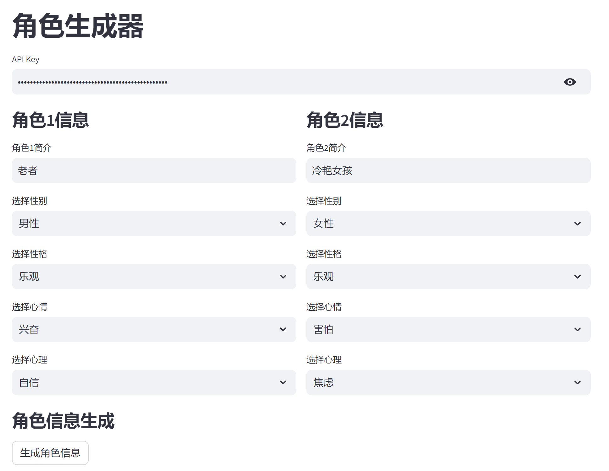
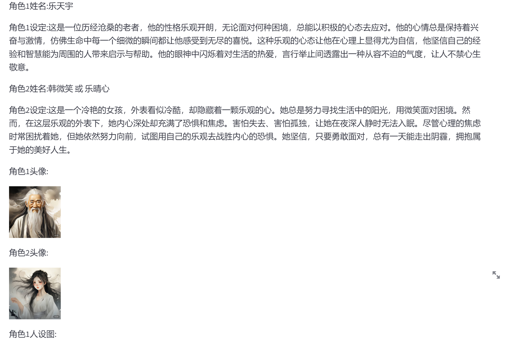
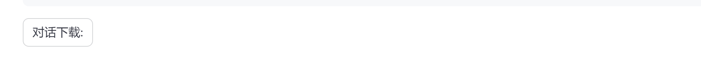

# glm-learning
## 环境准备
### 1. 安装 Miniconda https://docs.anaconda.com/free/miniconda/index.html
### 2. 创建glm虚拟环境
```
conda create -n glm python=3.10
``` 
### 3. 激活glm虚拟环境
```
conda activate glm
```
### 4. 执行安装依赖

```
git clone https://github.com/qingdengyue/glm-learning.git
cd glm-learning
pip install -r requirements.txt
```
    

## 启动功能

### 人设增加风格选项
#### 1. 启动
```
cd style
streamlit run characterglm-style.py    
```
#### 2. 界面说明:


### 角色对话生成
#### 1. 启动
```
cd style
streamlit run role_chat.py    
```

#### 2. 界面说明:
#####  2.1 角色信息设置


#####  2.2 生成信息展示


#####  2.3 下载对话文本
